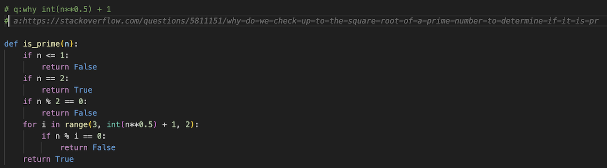

# Copilot に関するレポート

---

# 目次

- 本レポートの目的
- Copilot とは
- Copilot の使い方
- Copilot の評価
  - 実用性
  - ChatGPT との違い
  - 危険性や課題
- まとめ

---

# 本レポートの目的

GitHub Copilot とは何か，どのくらい有用なのか，企業での課題は何かなどを共有する

---

# Copilot とは(基本情報)

- 正式名称は GitHub Copilot
- 2021/7 月からプレビューとして公開され，2023/2/15 から Copilot Business が GA
- 現在の利用形態は個人利用と，企業利用の 2 種類
- 学習データは GitHub 上のパブリックコード

  - 数億行!(Amazing!)

> GitHub Copilot は AI ペア プログラマーです。 GitHub Copilot を使うと、エディター内で行全体または関数全体の候補を得ることができます。
> https://docs.github.com/ja/copilot/quickstart

## コードを書くときに AI がコードを提案(サジェスト)してくれる!!

---

# Copilot 利用の 前提条件

- Copilot は IDE(JetBrains や VsCode,NeoVim 等)が開発者とのインターフェイス
  - API は明示的に公開されていない
- 上記 IDE に Copilot の機能をインストールして利用する

---

# Copilot 機能 1

### コードを少し記述するとその文脈でサジェストしてくれる

## ちゃんとした最適なアルゴリズム!!

---

# Copilot 機能 2

### Q & A できちゃう！

ちゃんと正常な URL(1) でした(なんで？？)

だそうです

---

# Copilot 機能 3

### Ctl+Enter で 10 候補ほどサジェストしてくれる!

---

# Copilot 機能 3

### 選択したサジェスト上の Accept Solution ボタンを押すとコードに反映してくれる

---

# Copilot の使い方その他

- GitHub Copilot labs などがあり，コードレビューやコメント作成などのソリューションが実験的に検討されている

---

# 有用性について(GitHub 社調べ)

※ https://github.com/features/copilot/

---

# 有用性について(個人的な感想)

## Copilot なしではプログラム書きたくないほどに有用!!!

むむむ．．．わかってるやん

---

# 機能の有用性について

前のページのように，Copilot には単純なサジェスト以外にも Q&A や複数サジェストの機能がある

### ただし単純なサジェスト以外はあまり有用ではない印象

- Q&A と複数サジェストを Copilot でするぐらいなら ChatGPT の方が有用と感じる

---

# Copilot について考察

- Copilot は書きたいコードがわかっている時に，効果を発揮する印象
- コードの文脈を読み取るのが上手いので，コードを書けば書くほど Copilot が人間の意思を汲み取ってくれる印象
- 人間が書くコードが設計を意識した綺麗で一貫したものであるほど良いサジェストが来る印象
- コードを書く時間が減るので，設計やテスト,コードレビューに多くの時間を割けるようにすれば，速度だけでなく，品質も向上すると考えられる.
- 書きたいコードがわかっていない時にコメント文による指示や Q&A での質問はあまり精度が良くないかつ，サジェストされたコードのたしからしさがわからない
- 書きたいコードがわからない時は，検索するか ChatGPT と対話的にコードを書くのが良いと感じる

---

# 弊社想定利用シーン

- システム構築
- 既存のコードを修正する時
  - リファクタリングの方向性がわかっていると有用
  - テストコードを書くことも得意

---

# 適さないケース(個人的所感)

- 教育
  - 甘えてしまうようになる
- その場限りのコード
  - 適さないとまで言わないが，ChatGPT と対話的に行う方が有用なイメージ

---

# 機能の有用性について

---

# 利用形態について

### 1. Copilot for Individuals(10$ / month \* user)

### 2. Copilot Business(19$ / month \* user)

- 弊社は GitHub Enterprise を利用しているため Business での利用が可能
- Business の利点

  - Individual の機能全てを保有
  - Enterprise 全体への統一した policy 設定が可能
  - 自己証明書を利用する Proxy 設定が可能(Zscaler!!!)
  - Business の利用者は Enterprise 外の個人開発にも Copilot を利用可能

- 弊社環境では統一した policy 設定と Proxy の設定が可能な Business がベスト

---

# Copilot の動作原理

- OpenAI の Codex というモデルがバックエンドで推論，サジェストをしてくれる
- Copilot は VSCode などの IDE をインターフェイスとして動作する

---

# Copilot の危険性

- サジェストされたコードにバグがないとは言い切れない
  - 脆弱性を産みこむ可能性もある
  - これはコードレビューやテストでカバー可能
- Copilot が学習した GitHub のパブリックコードをそのままサジェストする可能性があるため,ライセンスが付与されているコードがサジェストされることがある
  - コードレビューなどでは，ある程度しか防げない

## 知らず知らずのうちにライセンス違反をしてしまう可能性がある!

---

# パブリックコードのサジェスト禁止機能について

Copilot の設定で Suggest matching public code を Block に設定可能

Copilot がサジェスト予定のコードの 150 文字以上のコードがパブリックコードと一致する場合にサジェストをブロックする機能

### これによってライセンス違反を防ぐことができる？？

---

# 案外そうでもない

1. マルパクリせずとも，コードが似ていればライセンス違反になる可能性は十分にある
   https://githubcopilotinvestigation.com/

2. この機能を ON にしてもマルパクリしている疑惑が検証によって発覚
   次のページで説明

---

# リファクタリング本のコードをそのままサジェスト

- リファクタリング本のサンプルコードをそのままサジェストしている
- ここでの問題は以下
  - リファクタリング本は著作権で保護されているため，そのままサジェストされた結果を商用で利用するとアウト
  - ### そもそもパブリックコードはブロックするんじゃなかったけ？

---

# 本件で浮き上がった新たな問題

著作権で保護されているコードがサジェストされるということは
GitHub 上には著作権やライセンスを無視して利用しているコードがたくさんある可能性が高い

### いろんな角度からサジェストによって違反をする可能性が出てくる

---

# ライセンス違反を予防する今後の機能

https://github.blog/2022-11-01-preview-referencing-public-code-in-github-copilot/

---

# 現在の MS の主張

## Copilot がサジェストしたコードはあなたのコードです※

※ 責任持てよという意味

---

# 参考

(1)https://stackoverflow.com/questions/5811151/why-do-we-check-up-to-the-square-root-of-a-number-to-determine-if-the-number-is

- https://github.com/features/copilot/
- https://zenn.dev/miyajan/scraps/3567cee380280c
