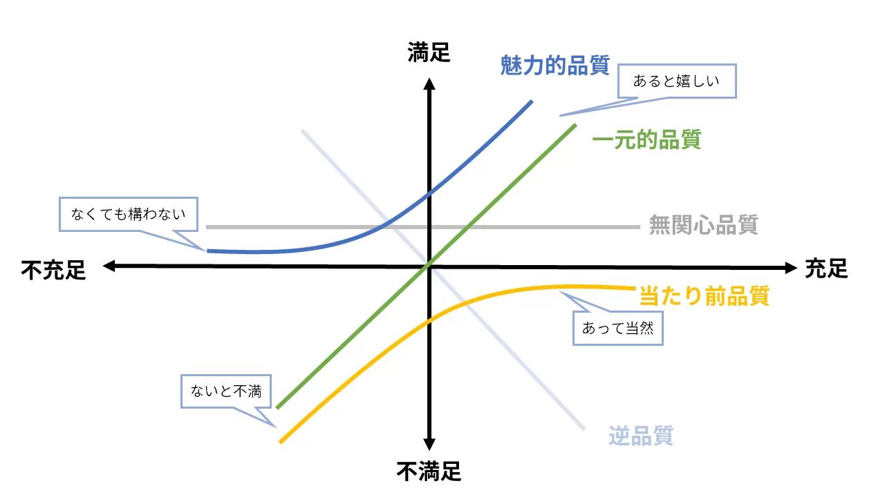

# ソフトウェア作成について

---

# 目次

- 目的
- IT 技術の重要性について
- ソフトウェア開発の難しさ
- どうすれば良いか？

---

# 目的

- IT 技術の重要性について理解する
- ソフトウェア開発がなぜ難しいのか，その理由を理解する
- ソフトウェア開発をどうすれば良いのか，その方法や理由を理解する

---

# IT 技術の重要性について

- 現代社会において IT 技術は非常に重要
- 様々な課題が IT 技術によって解決されていっており，解決されている領域も日々どんどん広がっている
- そのため IT 技術を迅速かつ継続的にデプロイ/デリバリーしている企業が優位に立っている

  - これは IT 企業に限らず，あらゆる企業において当てはまっている事実として分析されている

- 特に主要な IT 技術はソフトウェア
  - これはソフトウェアは柔軟で，すぐに変更，追加ができるから
  - ハードウェアの変更はなかなか難しい
- ソフトウェアをプログラムによって継続的に作成し，デリバリーすることが重要

---

# Accelerate 本抜粋

- 数多くの分析/調査を行い,どのような組織文化やプラクティスなどが企業を優位にしているのかをまとめた有名な本

| 2017               | ハイパフォーマ | ミディアムパフォーマ | ローパフォーマ    |
| ------------------ | -------------- | -------------------- | ----------------- |
| デプロイの頻度     | 1 日複数回     | 週 1 回から月 1 回   | 週一回から月一回  |
| 変更のリードタイム | １時間未満     | 1 週間から 1 ヶ月    | 1 週間から 1 ヶ月 |
| MTTR               | 1 時間未満     | 1 日未満             | 1 日から 1 週間   |
| 変更失敗率         | 0-15%          | 0-15%                | 31-45%            |

### 上の表は品質と速度にトレードオフな関係がないことを示している

---

# 品質と速度

- ここでいう品質とは IT サービスの品質
- ここでいう速度とは IT サービスをデプロイ／デリバリー(つまり利用者に提供すること)の速度
- ソフトウェア開発の文脈ではこの 2 つはどちらか一方を選択しなければいけないものではない,ということが前のページの表で述べていること

## 逆に言えばどちらか一方を犠牲にすると，両方とも犠牲になる

## 本当か？

---

# 考察:品質を重視して速度を軽視するケース

ここでは以下のように定義

- 品質を重視とはプログラムのバグを無くしたり，コードを綺麗にしたり，テストを充実させたりすることを過度に行うこと
- 速度を軽視とはサービスのリリース頻度が少ないこと

デメリット

- プログラムを入念に作り込んだが，利用者のニーズとマッチしなかった.
  - プログラムから作成されたサービスの品質は利用者が決めるものでもあり，利用者が満足しなければそれは品質が悪いと言える
- リリースすることで初めてわかるバグが出てきた.
- 先に同じようなサービスを他社にデプロイされた.

### 品質は高速なフィードバックによっても高めることができ,高速なフィードバックには速度が必要

---

# 高速なフィードバックについての補足

- この文脈のフィードバックとは至る所からもらうことができるもの
- 例

  - ソフトウェアを利用する利用者からのフィードバック
  - デプロイしたいことによる本番環境からのフィードバック

- また，本番へデプロイせずとも以下のようなフィードバックを得ることは可能

  - エディタのシンタックスハイライトによるエラー補足
  - コンパイルが失敗したことによるエラー補足
  - テストが失敗したことによるエラー補足
  - 検証環境での利用感検証

- できる限り高速で頻繁なフィードバックを得ることによる早期軌道修正が重要なのはいうまでもない
- また，品質も高めることができるのも想像できるはず

---

# 考察:速度を重視して品質を軽視するケース

ここでは以下のように定義

- 速度を重視とはとにかく動くプログラムを作成してとにかくデプロイする
- 品質を軽視とは汚いプログラムでも構わず，テストも準備しない.ひとまず動けばいい

デメリット

- 品質の悪いプログラムはどこを修正すれば良いかわからない状態になりやすく，さらに壊れやすい.
- 速度を重視して機能を追加したくても，どこに機能を追加すれば良いか，機能を追加してもプログラムが壊れないかは，品質が高くないとわからない.
- テストが十分でないので，変更によってバグが生じないか，ちゃんとデプロイできるかに自信がなくなる.

### 品質が高くないことには，安全/確実なプログラム作成は難しい.速度を求めるだけでは速度は手に入らない.

---

# プログラムの品質？テスト？

- プログラムの品質とは何か？
- なぜプログラムの品質が低いと機能の追加や修正が難しいのか?
- テストが十分でないと自信が持てなくなるのか？

---

# プログラムの品質の前に，品質とは...

- よく使う言葉ではあるが,抽象的で難しい話
- 誰かにとっての価値!という人もいる

---

# ソフトウェアにおける品質

- 以下は JIS に記載されているソフトウェア製品に対する品質特性

| 品質特性     | 説明                                         | 品質副特性                                     |
| ------------ | -------------------------------------------- | ---------------------------------------------- |
| 機能適合性   | 機能がニーズを満たす度合                     | 機能完全性，機能正確性，機能適切性             |
| 性能効率性   | リソース効率や性能の度合い                   | 時間効率性，資源効率性，容量満足性             |
| 互換性       | 他のシステムと情報の共有，交換ができる度合い | 共存性，相互運用性                             |
| 使用性       | 利用者がシステムを満足に利用できる度合い     | アクセシビリティ，UI 快美性,習得性             |
| 信頼性       | 必要な時に機能実行できる度合い               | 成熟性，可用性，回復性                         |
| セキュリティ | 不正利用から保護する度合い                   | 機密性，否認防止性，責任追従性，真正性         |
| 保守性       | システムを修正する有効性や効率の度合い       | モジュール性，再利用性，解析性，修正性，試験性 |
| 移植性       | 他の実行環境に移植できる度合い               | 適応性，設置性，置換性                         |

---

# 狩野モデルの 5 つの品質特性



---

# 品質には外部と内部の品質がある

- 外部品質

  - 機能適合性,使用性

- 内部品質

  - 性能効率性,互換性,信頼性,セキュリティ,保守性,移植性

- 外部品質は魅力的品質になりうるもので利用者が実際に感じる品質

### 外部品質は外部からのフィードバックを元に継続的に,実験的に高める必要がある

- 内部品質は当たり前品質であったり，利用者からは見えない品質

### 今回の議題であるプログラムの品質は内部品質にマッピングする

---

# プログラム品質について

- おさらいすると，ソフトウェアの内部品質については以下

  - 性能効率性,互換性,信頼性,セキュリティ,保守性,移植性

- 上記はプログラムコードによって達成されることが多い
- どれも大事ではあるが，根底にあるのが**保守性**と考える

---

# なぜ保守性?

- 保守って開発が終わったらやるものではないの？
- 全てが終わってからの開発とは少し関係のない話？
- と思われるかも(保守性という単語だけ見たら僕もそう思う)
- ただし表の説明をみると，"シテムを修正する有効性や効率の度合い"とある
- これを言い換えると，システムに機能追加やバグ修正がどのくらいやりやすいのか？ということ
- そして前のページでも述べたが，内部品質の多くはプログラムコードによって作成される
- つまり，そのプログラムコードに対してどのくらい機能追加，修正がしやすいのかは相当大事
- そのため保守性が根幹にあり，保守性によって他の内部品質が向上すると考えている

---

# じゃあどうやって保守性を高める？

- プログラムコードを機能追加，修正が容易なように記載する!
- 保守性の品質服特性としても書いてあることが良いヒント

モジュール性，再利用性，解析性，修正性，試験性

- また別の本では保守性と同じような意味として，複雑性管理を挙げており,そのためのプラクティスとして以下が記載されている

モジュラー性（modularity）,凝集度（一体性、cohesion）,関心の分離（separation of concerns）,抽象化（abstraction）,疎結合（loose coupling）

これらは全て正しく重要で保守性を高めるために必要な項目で，それぞれの特性同士は強く関連している

---

# 例:保守性が低いコード

- 同ディレクトリにある sample-bad-code.py は何をやっているのか？

```python
def main():
    print("Start")
    flag = True
    player1 = True
    player2 = False
    filed = []
    ...

if __name__ == "__main__":
    main()

```

- 一つの main 関数があり，その中で全ての処理を行っている

---

# 何が悪いのか

- 何がしたいのか直感的にわからない(抽象化がされていない)
- 一連の流れが記述されているだけで構造がない(モジュラー性がない，再利用性がない,関心の分離がされていない,密結合,凝集度がない)
- プログラムを実行する以外の方法で正常性を担保できない(試験性がない)
- 機能追加や修正をするときにどこを治して良いかわからない(修正性がない)
- 記述に重複があり，修正をする際に漏れが生じる可能性がある

### それぞれの特性は関連性が強いため，悪いコードはほとんど全ての関連性に当てはまっている

---

# 本当にそうか？

- 本当にそうなのか確かめるために，以下のようなことが簡単にできるか考えてみよう

  - マスの数を変えてください
  - 出力する文字を変えられるようにしてください
  - Player の名前を任意のものにできるようにしてください
  - ゲームをコンテニューできるようにしてください
  - バグがないか確かめてください

- 間違いなく，もれなくできるか？
- ストレスなく，すぐにできるか？

---

# 相当難しいはず

- できる人でもストレスはかかるはず

---

# 本番のシステムはこんなに単純じゃない

- 今回のサンプルコードはあくまでサンプル
- 価値のあるシステムはこの 100~10000 倍以上複雑
- その複雑なものに対して継続的に機能追加や修正をしなければいけない
- そのために重要なものが保守性の品質ということになる

---

# どうすればいいのか?

- 保守性に重要な要素を入れていくことになる
- そのための作業がリファクタリング

  - リファクタリングとは**プログラムの動作を変えずにコードを変更すること**

- リファクタリングによりコードを保守性の高いものにしていく

---

# リファクタリングのポイント

- リファクタリングは機能追加や修正ではない
  - リファクタリングと機能追加や修正を一緒にやってしまうと，複雑になりアンチパターン
  - どちらか一方を選択してプログラムを書く必要がある
- プログラムの動作を変更していないことを担保する仕組みが必要
  - 効果的なものが自動テスト
  - これがないと，リファクタリングのつもりが機能変更してしまうことがある

---

# 自動テストとは？

- システム全体やプログラムが正常な動作をするのかを確かめるのがソフトウェアの文脈でのテスト
- テストの実行方法には大まかに手動テストと自動テストがある
- 手動テストは，人間が，システムやプログラムを実行し，正しい振る舞いをしているのか人間が確認するもの

  - あきらかに時間，人件費などのコストが高く，信頼性も再現性も低い

- 自動テストは，手動でやっていたテストをプログラムで定義して，そのプログラムを実行することでテストを行うもの
  - テストプログラムを実行するだけで良いので，時間，人件費がほとんどかからない.
  - 一度書いてしまえば何度でも実行可能で，そのコストもほとんど 0 であることが最大のメリット
  - プログラム通りになるので，テストプログラムがしっかり書かれていれば信頼性や再現性も高い
    - ただし，書くの行為自体に知識が必要で，うまくやらなければ，信頼性も再現性もない，テストを作成する手間もかかることになる

手動テストは後に苦しみを持っていき，自動テストは最初に苦しみを持っていくもの

---

# 自動テストの例

```python
def test_add():
    assert_eq(add(3,4),7)
```

---

# 実際にリファクタリングをしていく:テストで保護

- まずはリファクタリングをするために既存のコードを自動テストで保護したい
  - 保護しないと，現在の挙動と変わってしまう
- 自動テストで保護するためにはコードに構造，つなぎめを作成する
- つなぎめを作れば，コードを独立してテストすることができるようになる
- いまは main 関数だけで一体ものとなっており，つなぎめがない.

やってみます

---

# 名前をつける

- main ではなく，特別な名前をつける
- 少しわかりやすくなったが，tik_tak_toe にはつなぎめがないのでやはり自動テストが難しい
- 一体何が自動テストを難しくしているのか？

---

# 外部との入出力はテストしにくい

- テストが難しいのは外部との入出力が一つある
- 今回のコードは人が数値を押下してそのデータを評価する．
- つまり，人がいないことにはテストができず,つまり自動化ができないということ
- また，外部への出力は外部の状態を調査しないことにはテストできないため，難しい
  - ターミナルに出力された値をどうやって調査する？これは実は技術的に難しい
- このような外部からの入力や，出力はテストが難しい

---

# 値が返るコードはテストがしやすい

- 値が返るとは，以下のように，関数などを実行した際に，データが返却されるもの

```python
def add(x,y):
    return x + y

sum = add(3,4) # 7
```

- 逆にデータを返却しないものもある.

  - 今回の例だと print や main

- 値が返る関数はきちんと値が返っているかどうか？と言うテストを書けば良いのでテストがしやすい

```python
def test(self):
    self.assertEqual(add(3,4),7) # 左と右が等しいかをテストするコード
```

---

# じゃあどうする？

- ここで値を返す関数を作成することと，関心ごとの分離をしたい
- 関心ごとの分離とは，コード中のいくつかの関心ごとを分離すること
- 今回で言うと，入力値を受け取るということと，ゲームを進めることは関心ごとが違う

  - 入力値を受け取って，どのようなデータとするかは自由
  - ゲーム自体は，プログラムの外部入力からじゃないと進めれないわけではない
  - しかし上の二つは現在同じ関数に書かれており，分離されていない

- ひとまずテストをできるように分離しよう！

---

# ゲームと入力の分離

- 入出力の一部分をゲームのロジックと切り離した
- tik_tak_toe 関数は複数の入力を受け取って，その入力で勝敗が決まったか，決まっていればどのプレイヤーが勝ったか結果を返す関数
- その結果の出力は tik_tak_toe の関心ごとから分離

- こうすることでテストがかける！

---

```python
class TestTicTakToe(unittest.TestCase):
    def test_tik_tak_toeは複数のinputから勝敗を判定する(self):
        def test_勝敗は決まっていない(self):
            (result, player) = tic_tak_toe([[0, 0]])
            self.assertEqual(result, False)
            self.assertEqual(player, 0)

        def test_勝敗が決まっている(self):
            (result, player) = tic_tak_toe([[0, 0], [1, 0], [1, 1], [0, 1], [2, 2]])
            self.assertEqual(result, True)
            self.assertEqual(player, 1)

        test_勝敗は決まっていない(self)
        test_勝敗が決まっている(self)
```

---

# 外部入出力の部分はいいの？

- いずれかは書いていきたい
- ただし，入力，出力のところは言語の標準機能を使っており，信頼性は高い
- そして，今はテストコードを書くことができたので，リファクタリングをしても内部コードが壊れてないかをすぐに確認できる

---

# どんどんリファクタリングしていこう！

- 簡単なところからやっていこう
- 例えば，フィールドを初期化しているところをやっていきたい
- ここは一つの関数として切り出すことで，コードが抽象的になり，わかりやすくなる
- フィールドの初期化で修正が必要になったときに，見るべきポイントがその関数だけになる

---

# リファクタリングしたら．．．

- 壊れていないかを確認しよう
- 確認にはさっき書いたテストコードを実行するだけ!
- 簡単!楽ちん
- テストをした結果壊れてなかったので問題なし!

---

# 次は勝敗の決定を切り出す

- このコードでは勝敗の決定を行，列，ななめに同じ印があるかを確認している
- このコードを切り出して(抽象化して)いく
- まずは行だけ
- そしてテストが壊れてないかチェック
- そして，列，斜めと続ける
- このようにすることでとてもすっきりとした記述になったのと，何か悪いことが起きたときに修正する場所が明確になった

---

# ちょいと待って

- すっきりしてわかったが，斜めのロジックが左上から右下の斜めだけでは？
- バグかもしれないので確認しないと．．．

---

# バグの確認

- じゃあ，バグを確認する必要があるので，プログラムを実行．．．する必要なし
- 僕らには自動テストがある
- テストコードを追記してバグをシミュレーションすることができる
- いちいち実行するよりも低コストかつ，良いテストケースとして残る

---

# 自動テストを追加してバグを検出

- 見事にテスト失敗!
- つまり予想通りバグがあったと言うこと
- このようにしっかりとした網羅的なテストは重要
- また，テストはバグを確認するためのツールとしても有用
- それではテストを通るようにしましょう
- どこを修正すればいいんだっけ．．．

---

# 抽象化，関心ごとの分離がされているので，修正箇所は容易にわかる

## もちろん is_win_diagonal_of でしょ

- 修正したらテストで確認
- 通った!!

---

- こんな感じでどんどんやっていく...
- 入力値の検証
- ユーザーの切り替え
- マスの出力

---

# どうなったか

- 綺麗に，意味がわかる構造になった
- わかりやすい(抽象化されている)かつ，関心ごとの分離がされているため修正や機能追加が楽になるはず

---

# 本当かどうか？

- マスの数を変えてください

をやってみようか...

返る場所がたくさんあってやりにくいな．．．

---

# なぜ？

- 凝縮度が足りないから
- 凝縮度とは意味的に同じものが同じところにある性質
- 凝縮していることで，修正に漏れがなくなったり，コードのわかりやすさが出てくる
- 今回はマスという概念の凝縮度が薄く，至る箇所に散らばっている
- マスという概念を作って，そこにマスに必要な機能を集約させる

---

# クラスを使う

- このようなときにはクラスという機能を使うと効果的
- クラスはデータとメソッド(関数とほぼ同義でロジックが書かれるもの)を持つ
- このクラスに，ある物事の概念を凝集するように定義することで，凝集度を上げる
- このような考え方がオブジェクト指向というもの一つの考え方

---

# 用語整理

- クラス
  - データとメソッドを定義したもの
- インスタンス
  - クラスが実際にプログラム上で利用できる状態になっているもの
  - クラスは定義して，そのあとコンストラクタを読んでインスタンス化することで利用できる
- コンストラクタ
  - クラスを生成する際に呼び出される特別なメソッド

---

# 例

```python
# クラスの定義
class Greet():
    # コンストラクタ
    # selfはこのクラスのインスタンスを指す
    def__init__(self,word):
        # クラスのデータとして設定している
        self.word = word
    # メソッド
    def greet(self):
        # self.~~で自分のデータや自分のメソッドを利用できる
        print(self.word)

    def greet_to(self,name):
        print(self.greet() + name + "さん")

def use_class():
    greet = Greet()
    greet.greet_to("kai")

```

---

# クラス設計:マスってなんだ？

- クラスを定義するときはマスっていうものの責務を考える
- その責務を達成しうるデータとメソッドをクラスに定義することで，凝集度や関心ごとの分離に立つ

例

- マスにはマス目の数が必要
- マスは全てのマス目を保持している
- マスは初期化時に自らのマス目分だけ，空のマスを作成する
- マスには何かを置くことができる
- マス目の数がわかっているのでマス指定時に入力できるのかがわかる

---

# マス目の数を変えてみよう

- class 化したので簡単のはず
- これも test を書いてうまく行っているのか確認しよう

---

# と思いきや，

- tic_tak_toe の関数にはマス目を与えることができない
- これだと変更できないので，tic_tak_toe の引数にマス目を入れる
- これでうまくいくか？
- テストはクリア，でも出力されたものが 8x8 じゃないぞ...
- もしかして，うまくいってないのでは？
- 勝敗がついていない場合もテストケースとして追加する
- やはり失敗した.バグがある

---

# なぜか？

- 揃っているかどうかのロジックがマスと違うところで定義されている
- このロジックをマスに凝縮させる
- ただし，マスに勝利しているか？という概念はないので別の名前をつける
- そして，出力する処理は引数に masu を撮るようにする
- これによって，マス目の変更が簡単になった

---

# 他の要件も満たせるような設計に使用

- 出力する文字を変えられるようにしてください
- Player の名前を任意のものにできるようにしてください
- この二つは Player クラスを作ってしまう

---

# Player クラス

- player には表示名がある
- player にはマス目に設置できるものがある
- そして，勝利時には player を返すようにする
- ここで tic_tak_toe の返り値が変わることになるのでてすともかえなくてはいけない

---

# テストを保守するということ

- テストは書けばいいものでもない
- 書いた時から保守の必要性が出てくる
- 今回のようにテスト対象のインターフェイスが変更されればテストも変えなくてはいけず，それ自体はコストになる
- そういうことを意識して必要最低限でメンテナンスしやすいテストにするべき

---

# 今のままではテストをかけない

- player を作り，結果として返すことにしたのも良いが，そもそも player が tic_tak_toe の中で作られているので，比較できない
- tic_tak_toe のインターフェイスを大きく返るべき
- そもそも tic_tak_toe 自体もクラスにするといいかも
- クラスと関数の違いの一つとしてクラスは状態を保持することが容易

  - ただしこれが悪とする考えもあるので，あくまで違いとだけ書く

- 今回の登場人物として，player と masu とそれらを駆動する TicTakToeGame クラスがあっても良い
- ただ，player と masu はすでにあるので，game クラスを作っていく

---

- turn というメソッドで一回のターンで行う全てを記述できた
  - turn 内の記述は抽象度が高く，わかりやすい
  - 何かが起きても修正が用意
- テストもクリアし，main を変更，tic_tak_toe 関数は不要になったので削除
- 現在残っているのは，TicTakToePlayer,Masu,TicTakToeGame,main だけで，それぞれが各々の役割持っている
- game には masu と player をどう相互作用させるのか？勝敗はどうか？ゲームとして，表示はどうするかがある
- masu,player にはそのような情報はなく，ゲームという関心ごとは分離されていて，疎結合ということになる

---

# main の責務について

- 現状はデータの初期化や外部からの入力受付，game の結果が終わっているかどうかを確認している
- ただ，turn ロジックを勝敗がつくまで loop させる責務は game クラスにあるようにも思える
- main は game に必要な情報を作成し，game を実行するだけにしたい
- そして game は自分で loop を回して，自分で game の終了や結果表示を行わせたい
- この loop をどうにか持っていきたいが，そうすると，game が input をループのたびに受け付ける必要がある
- そうすると最初のモチベーションであった，input と game の分離がどうしても難しくなる
- そこで input の仕組みを少し変えて game の中に取り込むようにする

---

# input の仕組みを変える？

- 現在は外部から input を受け取る，という仕組みと game の仕組みは関心ごとが違うということで分けていたが，何かしらの input を提供する仕組みから game はデータを受け取るといった疎結合な仕組みにすれば，外部から受け取るといったことにならなくなる
- そのようにするとテストも書くことができるようになる
- つまり，game を外部からの input に依存させるのではなく，どこかしらかの input に依存させれば良い
- input interface をもった何かに依存させるようにする

---

# interface?

- メソッドの定義が書かれているもので実態ではない
- python には言語としての機能がないが他の言語だと interface があったり似たような機能もある
- 他のクラスや関数が，クラスや関数そのものに依存するのではなく，interface という定義に依存するようにすれば，その interface を身につけている物であればなんでも良いということになり，実質したいことだけに依存するようになる
- これにより，テストもしやすくなる

---

# やっていく

- まずは input のインターフェイスとして，以下のようなメソッドを持つことを想定する
- python では interface がないので，心で定義する
- 今回は InputProvider という interface を使う
- これは provide_x と provide_y というメソッドを持つ interface ということ
- ただし，interface は実装しないことには意味がないので，実際に実装するクラスを定義する
- まずは今まで通りに Terminal から取得する方法として，メソッドに provide_x,provide_y を持つ TerminalInputProvider を作成
- ただしこれだと意味がないので，FakeInputProvider も作成する
- これはテストように利用するクラスで，初期化時に返す値を設定すると，その通りに返してくれる物
- Game クラスは TerminalInputProvider ではなく，InputProvider に依存しているので，TerminalInputProvider を使おうが，FakeInputProvider をつかおおうが Game クラスからしたら問題ない
- これにより外部入力ではなく，InputProvider という開発者がコントロールしやすい形に依存するようにしたことで，ずっと扱いやすくなった
- これは試験性，要はテスト容易性と，関心ごとの分離に役に立っている

---

# 最終成果物:main

```python

# main
def main():
    player1 = TicTakToePlayer(
        "Player1",
        "■",
    )
    player2 = TicTakToePlayer(
        "Player2",
        "●",
    )
    game = TicTakToeGame(player1, player2, 3)
    game.start(TerminalInputProvider())

```

---

# 最終成果物:TicTakToeGame

```python
class TicTakToeGame:
    def __init__(self, player1, player2, masu_num):
        self.player_index = 0
        self.players = [player1, player2]
        self.masu = Masu(masu_num)

    def start(self, provider):
        self.display_start()
        while not self.is_finished():
            x = provider.provide_x()
            y = provider.provide_y()
            result = self.turn(x, y)
            if result is not None:
                self.display_end(result)
                return result
        return None

    def turn(self, input_x, input_y):
        if not self.masu.validate_inputs(input_x, input_y):
            self.invalid_input_alert()
            return None

        self.masu.put(input_x, input_y, self.players[self.player_index].mark)
        self.display_field()
        if self.is_finished():
            return self.players[self.player_index]

        self.switch_player()
        return None

    def is_finished(self):
        return (
            self.masu.align_column() is not None
            or self.masu.align_row() is not None
            or self.masu.align_diagonal() is not None
        )

    def switch_player(self):
        self.player_index = (self.player_index + 1) % 2

    ...
```

---

# 最終成果物:Masu

```python
class Masu:
    def __init__(self, masu_num):
        self.masu_num = masu_num
        self.filed = []
        for i in range(self.masu_num):
            tmp = []
            for j in range(self.masu_num):
                tmp.append(0)
            self.filed.append(tmp)

    def put(self, x, y, data):
        self.filed[x][y] = data

    def align_column(self):
        for i in range(self.masu_num):
            mark = self.filed[0][i]
            if mark == 0:
                continue
            for j in range(self.masu_num):
                if self.filed[j][i] != mark:
                    break
                if j == self.masu_num - 1:
                    return mark
        return None

    def align_row(self):
        for i in range(self.masu_num):
            mark = self.filed[i][0]
            if mark == 0:
                continue
            for j in range(self.masu_num):
                if self.filed[i][j] != mark:
                    break
                if j == self.masu_num - 1:
                    return mark
        return None

    def align_diagonal(self):
        mark = self.filed[0][0]
        for i in range(self.masu_num):
            if mark == 0:
                break
            if self.filed[i][i] != mark:
                break
            if i == self.masu_num - 1:
                return mark

        mark = self.filed[0][self.masu_num - 1]
        for i in range(self.masu_num):
            if mark == 0:
                return None
            if self.filed[i][self.masu_num - 1 - i] != mark:
                return None
            if i == self.masu_num - 1:
                return mark
        return None

    def validate_inputs(self, input_x, input_y):
        if int(input_x) > self.masu_num - 1 or int(input_y) > self.masu_num - 1:
            return False
        if self.filed[int(input_x)][int(input_y)] != 0:
            return False
        return True

    ...

```

---

# 最終成果物:Player

```python
class TicTakToePlayer:
    def __init__(
        self,
        name,
        mark,
    ):
        self.name = name
        self.mark = mark

    def is_player_mark(self, mark):
        return self.mark == mark
```

---

# どうなったか？

- 行数は 200 行ほどになり，元の行数よりも倍程度増えている
- ただし，とても可読性が上がった
  - 可読性が上がることは，チームメンバーや半年後の自分にとっても良いこと
- 関心の分離ができた
- テスト容易な構造になった
  - リファクタリングを恐れずにすることができる
  - バグが生じても，自動テストによるバグの再現および，そっからの修正が可能になった
- 何かが起きてもすぐに修正，機能追加できるようになった

---

# 本当か？

- 以下の機能追加をしてみよう

  - Player の名前を Terminal から入力できるようにしよう
  - マス目を以下のように表示しよう
  - 引き分けの場合も考えよう

  ```
     y
  x  0 1 2
  0 |■|■|■|
  1 |■|■|■|
  2 |■|■|■|
  ```

## アルゴリズムは難しくても，どこを編集すれば良いのかはすぐにわかるはず

---

# こんなにうまくリファクタリングできるのか？

- 今回はざっと書かれているコードに対して，まずはテストで保護できるように変更し，リファクタリング可能にした
  - 正直ここはなかなか難しかった
- その後に少しずつ責務を分解して，リファクタリングをしていった

  - input と game のロジック
  - game の中にも masu と player
  - game として評価するロジック
  - input を抽象化してテスト可能に，game と input の関係を疎に

- これはなかなか技術がいるのではないか？

---

# 技術は必要

- 特に責務を分解するのはなかなか難しい
- また，テストで大きなコードを保護するのもなかなか難しい
  - 最初にテスト可能にするようにつなぎめを作成する必要があるが，その作成でもともと動いていたものを壊すかもしれない
  - 安全に行う方法はあるが，今回のように外部へ入出力するものは値を補足することが難しいため難易度が高い

---

# なぜ難しいのか？

- 何も考えずにコードを処理順に書いていたから
- そのようなコードをリファクタリングしたり，機能追加したり，テストしたりすることは大変難しい
- 最初から構造や責務を考えながらコードをすこしずつ記述することで上記のようなことを防ぐことができる
- このように品質を最初から作り込むことで，スピードもあとから上がってくる
  - これは前述の通り

---

# じゃあどうすればいいのか？

- もちろん練習あるのみ
- ただし，初めから責務を考えて構造のあるプログラムが書かれやすいとされているプラクティスがある

それは...

# TDD(Test Driven Development:テスト駆動開発)
