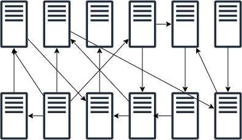

# 大規模データ管理に関するレポート

---

# 目次

- 本レポートの目的
- 大規模データ管理本の概要
- データ管理の崩壊

---

# 本レポートの目的

- 大規模データ管理で紹介されていた考え方にや技術的観点について共有する
- IT 推進部として関わるところと部門に委任する境界に関する考え方を提示する

---

# 大規模データ管理本イントロ

- 筆者は大企業のデータアーキテクチャ計画を推進した際の経験に基づいている

  - 直近十年の間,企業がデータ駆動になるための完璧なソリューションを探し続けていた

- データ管理と統合に関する先進的なアプローチが紹介されている
- 筆者が思い描いているのは長期的に使い続けられるような最新の**分散型ドメインベースアーキテクチャ**

## この本ではこのアーキテクチャを Scaled Architecture と呼ぶ

---

# データウェアハウスやデータレイクとの違い

- 分散型で,ドメインベースあること

  - ドメインとは，ビジネスの問題領域のこと
    - 例えば, 顧客情報, 製品, 販売, 物流,財務など

- 分散型なので他のドメインとは疎結合が望ましい
- 緩やかな統合なので小さく始められる
  - というか小さく始めるべき!!

---

# 　データ管理の崩壊

---

## 現在機能している中央集権的なソリューションは将来的にうまく機能しなくなる

---

# データ管理崩壊の理由

- ソフトウェアの提供速度とともにデータの複雑度も増している

  - システムの負荷や，プライバシーや法規制についても考える必要が出てきた
  - データの管理方法が重要

- データレイクやデータウェアハウスはデータ消費の要求が急速に高まることは想定してない
- 中央集権モデルは破壊的なトレンドによって失敗する可能性がある

---

# 企業を悩ます時代遅れのデータアーキテクチャ

- 企業のデータ統一は非常に複雑なプロセスで完了するまでに何年もかかる
- 統合は関係する全てのチーム間での調整が必要になり，サービスに大量のオプション属性がついてしまう
- データが増えれば増えるほど，また定義の矛盾や不整合が生じれば生じるほど調整が難しくなる
- その結果全ての人のニーズを満たすために妥協した，誰にも特化していないモンスターインターフェイスが出来上がる
- あまりにも汎用的なもので，サービスが正確に何を提供しているのか，何をしているのかが誰にもわからない

### コンテキストを統一しても誰にとっても意味のないものになってしまう!

---

# これまでのデータアーキテクチャ

---

# データウェアハウス

### 本資料上のデータウェアハウス定義

RDB などを使い，全てのデータを構造化して統合管理するソリューションのこと

### 欠点

- 結合によって生じる多くの依存関係
- アジリティの欠如
  - アジリティが欠如すると人は抜け道を探し出し，それが技術的負債になる
- データの流通や消費に関する情報は欠如
  - **データの所有権や出所もわからなくなる**

---

# データレイク

### 本資料上のデータレイク定義

非構造データなど，ほとんど全てのデータを統合管理するソリューションのことで一般にオブジェクトストレージ環境

### 利点

- 生データを提供するので迅速

### 欠点

- 常にデータの修正が必要なため何度も何度も変換作業が繰り返される
- データのコンテキストを整えるために，他のデータと組み合わせないといけない
- 生データはいつでも変化する可能性があり，実験やユースケースを本番環境に導入できない

---

# ちなみに

## Garther のアナリスト Nick Heudecker はデータレイク導入の失敗率は 6 割を超えているとツイートしている

## TechRepubilc では 85% のデータプロジェクトが失敗していると報告している

https://www.techrepublic.com/article/85-of-big-data-projects-fail-but-your-developers-can-help-yours-succeed/

---

# どうやるのか？どう始めるのか？

---

# ビジネスケイパビリティへマッピング!

- 機能、価値提供、情報、組織構造等の**設計**が不可欠
  - ドメイン駆動設計(DDD) がおすすめ
- すべてのビジネス目標をビジネスケイパビリティにマッピングし，ビジネスケイパビリティとバリューストリームにまとめる

  - バリューストリームを用いることで，ビジネスにおいて，外部や内部のステークホルダーが組織から得ることのできる価値の流れが明らかになる

- ビジネスケイパビリティとアプリケーションアーキテクチャの関係を明確にすることで多くのメリットが得られる

  **データとその所有者が決まる**

---

# エンタープライズ規模での DDD

- データ流通にデータウェアハウスのような大きなサイロを使わない
- コンテキスト境界ごとに分離することが大事
- 他のコンテキスト境界と通信する場合は必ずデータレイヤー(後述)を通して行う必要がある
- DDD ではコンテキスト境界ごとに独自のユビキタス言語が使われている
  - コンテキスト境界が変わればユビキタス言語も変わる
  - エンタープライズ言語は多くのユビキタス言語の集合体となる

---

# DDD によるアーキテクチャ イメージ図

---

# DDD アプローチの良さ

---

# 1. アジリティが大幅に向上する

- データプロバイダーとデータコンシューがより疎結合になり，データがサイロで統合されるまで待つ必要がないから
- ドメインが持つ依存関係はデータレイヤーのみになる
  - 論理的なコンテキスト境界内に存在するビジネスドメインはそれぞれ独自の速度で変化できるようになる

---

# 2.単一ステップの変換

- DDD モデルではプロバイダーのコンテキストからコンシューマーのコンテキストへの単一ステップの変換だけでよくなる
- 企業全体の単一の統合ソリューションを作る必要がなくなる
- 企業レベルの統合をしないことで不整合や情報の複数バージョンが存在することを避けることができる
  - これらはデータウェアハウスで問題になっていたこと

### ただし課題はデータプロバイダーの存在を知っている必要があること

### -> メタデータやメタデータによるサービスディスカバリで解決する!!(後述)

---

# 通信と統合のパターン

---

# ポイントツーポイント

- アプリケーションから別のアプリケーションへ、直接通信を行うポイントツーポイント
- アプリケーション間が密結合になってしまう
- 運用管理も大変

---

# サイロ型

- 全てのデータとアプリケーションロジックをまとめてサイロを作る
- いくつもの不整合を生み出し，統合作業が膨大となる
- 運用管理も大変

---

# ハブスポークモデル

- 中央にデータ流通のためのハブを作成して、様々なシステムやアプリケーションのインターフェイスを接続
- アプリケーションはハブに接続するだけで良い

---

# 企業が必要としてるのは、データプロパイダーとデータコンシューマを簡単に接続し、柔軟性、コントロール、インサイトを提供できる、スケーラブルで高度な分散型アーキテクチャ

---

# データレイヤーについて

---

# データレイヤー

- データ変換を容易にすると同時に，ポイントツーポイントの複雑さを軽減し，サイロ型を回避できるような新しいモデルがデータレイヤー

- ドメインが多種多様なパターンを使ってデータを流通できるようにする
- データレイヤーはデータ流通の基盤となるインフラやプラットフォームを活用して，すべてのデータ管理要件が十分に満たされていることを確認可能

---

# 読み出し専用データストアアーキテクチャ

- Readonly Data Store(RDS)は読み出しに最適なもの
- RDS は不変なデータベース
- RDS には、権威あるオリジナルのゴールデンソースデータセットのみ配信出来る
- データプロバイダーのコンテキストが RDS の設計を決定する
- データプロバイダーは、データ品質、設計、RDS への配信に責任を負う
- RDS は単なるデータレイクやデータウェアハウスではなく、既存のアプリケーションを拡張し、そのコンテキストを継承するもの

## 用途

- 大量のデータを扱うユースケース向き(BI や分析など)
- 耐久性、受動性、永続性のあるデータを保持、大量に読み出すことに向く

---

# API アーキテクチャ

- 書き込み，更新，削除処理を容易にする
- 図
- リアルタイムの同期通信を要するユースケース向き
- データとビジネス機能の両方を提供できる

---

# ストリーミングアーキテクチャ

- ストリーミングと API が異なるのは非同期であること，高いスループットを重視すること，そしてアプリケーションの状態をコピーするためにも使用できるようにすること

- 図
- リアルタイムにデータを変換し、ほかのアプリケーションに通知する
- ストリーミングアーキテクチャで構成したプラットフォーム(データレイヤー)を RDS として使うことも可能
- アプリケーションの状態を伝えるイベントを流通し、(それをトリガーに)データのレプリケーションをとることもできる

---

# この 3 つのアーキテクチャは完全にメタデータ駆動型

- メタデータは流注のリネージや消費要件，データの品質，意味などについての情報を提供する
- このメタデータを API 経由で公開することで，データプロバイダーとデータコンシューマーはさまざまなアーキテクチャとの相互運用性が高まり，データパイプラインの自動化を実現できるようになる
- インターフェイスの複雑さを管理する上で大きな効果を発揮する
- メタデータはポータルなどに載せて民主化したい

---

# メタデータの恩恵

- メタデータは内部のルーティングや流通の他，意味の把握やデータ完全性の検証にも使われる
- どのデータがデータレイヤーを通過するのかがわかるため,エンドツーエンドのリネージを可視化することができる
  - リネージとはデータの作成から現在に至るまでの全履歴を追従可能にすること
- さまざまなドメイン間で激しい通信が行われている場合はコンテキスト境界が間違っていることがわかる
- サービス間の集中的なデータ交換は一般的にそれらのサービスが実際には単一のサービスであるべきことを意味する
- このようにメタデータはアーキテクチャの全体の中で重要な役割を担っている

---

# アーキテクチャ全体イメージ図

---

# まとめ

- 中央集権的なモノリスを取り除くことでドメインやチームが独立してデータを変更・交換できるようになる
- 各ドメインは全体アーキテクチャのある部分に対して責任を持つ
- データはデータレイヤーを経由させる
- 単一の統合ソリューションやプラットフォームで全てのユースケースに対応できない
- 新しい統合アーキテクチャには企業全体を見る視点が必要

---

# IT の責務についての考察

---

# 中央プラットフォーム

- ほかのドメインがセルフサービス方式でデータを提供・消費できるようにする
- プラットフォームは、繰り返し行われる作業をできるだけ減らすことを求められる
- ドメインに依存しない仕組みを構築する
  **中央チームは、ほかのドメインチームのためにビジネスロジックやアプリケーションを採用したり、構築したりしてはならない**

---

# 重要なこと

- ドメインに依存しないインフラは、中央プラットフォームチームが提供する
- 他にも、中央プラットフォームチームは以下を定義する必要がある
  - データ提供/消費のためのパターン
  - メタデータの登録方法
  - セキュリティとポリシーの適用

---

# メタデータによるサービスディスカバリ

- サービスを把握できるようにすべての API リストをサービスレジストリで管理することがおすすめ
- サービスレジストリとはすべての重要な API 情報を中央のレポジトリに保存するツール
- サービスレジストリにより，サービスの再利用が促進され，API の増殖を避けることができる
- サービスレジストリはすべてのサービスとどの API が誰によって公開されたり，消費されたりするのかを管理する

---

# 始めるうえで検討すべき観点

- どのようなビジネスメタデータが重要か
- システムの相互運用に必要なメタデータは何か
- どのようなプロセスやストリームでデータを取り込んでいるか
- モデルやスキーマはどこで作成され、管理されているか
- データガバナンス部門が適切に業務を遂行するために、どのような情報を、チームが中央に提供する必要があるか

---

# まずまとめるべきところ

- アプリケーションのリスト
- 権威あるデータソース
- データベースとインタフェースのスキーマ
- データの所有権
- セキュリティ

---

---

# 補填

---

# Scaled Architecture 原則

---

# Scaled Architecture 原則(1)

- ゴールデンソースから生成されるゴールデンデータセットの流通のみを許可
  - ゴールデンソース，ゴールデンデータセットは後述
- データ変更はゴールデンソースでのみ行う
- ゴールデンデータセットだけを提供する
- ゴールデンデータセットとメタデータなどの要素は検索性を高めるために中央に登録される

  **ゴールデンソースと所有権メタデータをツールやプラットフォームを通じて中央で利用できるようにすることが重要**

---

## アプリケーションごとにアプリケーションデータベースを持つ

- アプリケーションは特化したものであり、一意のコンテキストを持つ
- 何かのデータを何かのアプリケーションから取得したい場合は，そのアプリケーションに問い合わせる
- アプリケーションでコンテキストを表現するため直接 DB に問い合わせるよりもデータを消費しやすくなる

---

## ゴールデンソース

- 権威あるアプリケーション
- すべての信頼できるデータがある特定のコンテキストで管理されている
- 一つか複数のゴールデンセットで構成されている

---

## ゴールデンデータセット

- 生成された権威あるオリジナルデータのこと
- 真正、かつ一意なもので，正確で完全でよく知られていなければいけない
- 人間が読むことのできる情報である**データ要素**で構成
- データ要素には識別可能な名前がついており，データガバナンスなど他データ管理主体との接着剤の役割を果たす

---

### データに対して正確で一貫性を持たせることができる

---

# 原則

- コンテキスト境界はインスタンス化されたビジネスケイパビリティに関係付けられる
- コンテキスト境界は 1 つまたは複数のアプリケーションに関連づけることができる
- コンテキスト境界はインフラストラクチャー，ネットワーク，組織から独立する
- 一つのコンテキスト境界は一つのチームに属する
- 境界線は厳密にする
- データレイヤーはドメインロジックを含むべきではない

---

## 原則

- 抽象的なインターフェイスにしてアプリケーションの技術的な情報を隠す
- インターフェイスには一定の成熟度と安定性が求められる
- コンシューマが意味的に理解できるような形で提供してデータ消費に最適化する
- データプロバイダーとして機能するコンテキスト境界はそれぞれ独自のユビキタス言語を使ってデータを公開する必要があり，データプロバイダーは他のドメインのビジネスロジックを自分のドメインに組み込むべきではない

### これらの原則から結論づけられるのはデータプロバイダーはより使いやすく，より消費しやすく，論理的な方法でデータを公開すべきということ

- 生データにつきものの繰り返し作業は避けるべき
- 論理ビジネスモデルの抽象版としてデータは表現されるべき
