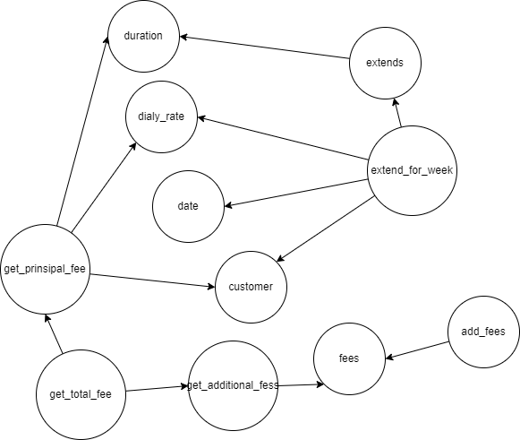

# 20 このクラスは大きすぎてこれ以上大きくしたくありません

- システムに追加する機能の多くはちょっとした微調整
- そのような場合、既存のクラスに変更を加えてしまいがち

## 責務の把握

- すべてのメソッドを列挙して、名前を検討することでそれらの目的がなんであるかを考えることから始めた
  - そこでは主に、なぜこのメソッドがここにあるのかと、このメソッドはクラスのために何をしているのかを考える
  - 次に同じような理由を持つメソッドをまとめてメソッドをグループに分類
- 重要なのは責務を把握することと、責務を適切に分割するやり方を学ぶこと

  - 新しい機能を作り上げる時よりもレガシーコードを扱うときのほうが設計スキルを発揮する機会ははるかに多くある
  - 実際に影響を受けるコードがあるため、設計のトレードオフに関する議論が容易になる

## 責務を把握する経験則

### 経験則 :名前が似ているメソッドを探す

- クラスのすべてのメソッドをアクセス属性と共に書出し、一緒にできそうなものを探す
- 特に巨大なクラスに適している
- ここで大事なことは、必ずしもすべてのメソッド名を新しいクラスに分類する必要はないということ
- 共通の責務を構成しているように思えるメソッドがあるか調べること
- もしクラスの主要な責務から外れている責務を特定できればコードをどういう方向に徐々に持っていけば良いのかがわかる

### 経験則 2

- private メソッドに注意する
- クラスにそのようなメソッドが多く含まれる場合、しばしばそのクラスの中から別のクラスを取り出せることを示唆している
- 大きなクラスはあまりにも多くのことを隠蔽できてしまう
- private メソッドをどうしてもテストしたいのであればそのメソッドは private にすべきでない
- class に分離して public なメソッドとして持たせてあげるべき

### 経験則 3 変更可能な決定事項を探す

- これはコードにこれから作りこむ決定事項ではなく、すでに決定した事項を指す
- データベースへのアクセスやほかのオブジェクトの利用方法などに関して、何かを行うための何らかの方法として、ハードコードされているものはあるか？
- それが変わることはあるか？
- 一つのメソッドに注目しても、そのコードがどれだけ多くの処理を行っているのか、どれだけの責務を持っているかの見当はつかない
- このような理由から、抽出するクラスを決める前にはメソッドを抽出するリファクタリングを少し行ってみるのが効果的
- 度のメソッドを抽出すべきか？
  - 見つけ出すために、決定事項を探す
  - コードではどれだけの事項を想定しているのか？
  - そのコードは特別な API のメソッドを呼び出しているのか？
  - 常に同じデータベースにアクセスすることを想定しているのか？
  - コードがこのようなことをしているなら、意図したことを表すメソッドを高いレベルで抽出するのが有効
  - データベースから特定の情報を取得している場合なら、その処理をメソッドに抽出して取得する情報にちなんだ名前を付ける
  - このような抽出を行うことで、メソッドは増えるが、メソッドの分類がより容易になることがわかる
  - それよりも有益なこととして、一連のメソッドの背後にあるリソース(特別な API やデータベース)を完全にカプセル化している
  - これらのメソッドをまとめてクラスとして抽出すれば下位レベルの詳細に関する依存関係を排除できる

### 経験則その４内部的な関係を探す

- インスタンス変数とメソッドの間の関係を探す。あるインスタンス変数は一部のメソッドでしか使われないのでは？
- すべてのメソッドがすべてのインスタンス変数を使っているクラスはめったにない
- 通常、クラス内には何らかのまとまりがある
- ３つの変数がある場合にそれらをすべて使うのにはせいぜい 2 つか 3 つのメソッドかもしれない
- 多くの場合、この関係を把握するために名前が役に立つ
  - RuleParser クラスには variables というコレクションの変数と addVariable というメソッドがある
  - これらの名前にはメソッドと変数の間に明確な関係があることを示している
  - variables 変数にアクセスするメソッドがほかにもあるかどうかはわからないが、少なくとも調査の手掛かりになる
- このようなまとまりを見つけるためのもう一つの手法はクラス内部の関係を表す小さなスケッチを作ること
- それは機能スケッチと呼ばれるもの
- 機能スケッチはメソッドとインスタンス変数がクラス内のどのメソッドで使われるかを示すもので、とても簡単に作ることができる

```rust
struct Reservation{
    duration: usize,
    daily_rate: usize,
    date : Date,
    customer: Customer,
    fees: Vec<Fee>
}

impl Reservation {
    pub fn new(
        duration: usize,
        daily_rate: usize,
        date : Date,
        customer: Customer,
    ) -> Self {
        Self {
            duration,
            daily_rate,
            date ,
            customer,
            fees:Vec::new()
        }
    }
    pub fn extend(&mut self,additional_days:usize) {
        self.duration += additional_days;
    }
    pub fn extend_for_week(&mut self) {
        let week_remainder = RentalCalender::week_remainder_for(self.date);
        const DAYS_PER_WEEK:usize = 7;
        self.extends(week_remainder);
        daily_rate = rentalCalender::compute_weekly(self.customer.get_rate_code()/DAYS_PER_WEEK);
    }
    pub fn add_fee(&mut self,rider:FeeRider) {
        self.fees.add(rider);
    }
    fn get_additional_fees(&self)->usize {
        let total = 0;
        for it in self.fees.iter() {
           total += (it.get_amount())
        }
        total
    }
    fn get_principal_fee(&self)->usize {
        self.delay_rate * RateCalculator::rate_base(self.customer) * self.duration
    }
    pub fn get_total_fee(&self) {
        self.get_principal_fee() + self.get_additional_fees()
    }
}


```



- 上の機能スケッチから、このクラスの中にはちょっとしたまとまりがあるということがわかる

- duration,daily_rate,date そして、customer の各変数は get_principal_fee,extend,そして extend_for_week メソッドから主に使われている
- 機能スケッチを描くことでクラスを分割するいくつかの方法を試すことができる

- これを行う場合には機能のグループをまるで囲む
- 機能を丸で囲むとそれに交差する線から新しいクラスのインターフェイスを定義できる
- 丸を描くときには各グループのクラス名を考えること

  - 実際にクラスの抽出を行うかどうかは別にしてこれは名前付けの能力を磨く優れた方法

### 経験即 5 主要な責務を探す

- クラスの責務を 1 文で説明してみる
- これもあれも言っているようだと、ほかの責務があり、ほかのクラスに追いやる必要性がある
- 単一責務の原則に対する違反は 2 種類ある
  - それはインターフェイスレベルの違反と実装レベルの違反
  - クラスが非常に多くのことに対して責任を持つようなインターフェイスを持つ場合はインターフェイスレベルの違反をしている
- 最も注意すべき単一責任の原則の違反は、実装レベルの違反

  - これをわかりやすく言うと、クラスがたくさんの責務をすべて実際に処理しているのか、いくつかの別のクラスに委譲しているだけなのかに着目する
  - 委譲しているのであれば、それは Facade に過ぎないため、容易に管理できる

- インターフェイスレベルの問題はどのように解決すればよいか
- 一般的な手法は、委譲する先のクラスの内で、呼び出し側から直接的に使えるものがあるかどうかを調べること
- 要は必要最低限なインターフェイスにしろってこと？

## インターフェイス分離の原則

- 大きなクラスの場合、すべてのクライアントがそのクラスのすべてのメソッドを使うことはめったにない
- たいていの場合、特定のクライアントごとに使用するメソッド群は異なっている
- メソッド群ごとにインターフェイスを作成し、大きなクラスにそのインターフェイスを実装させることで、各クライアントは特定のインターフェイスを通じて大きなクラスを参照できる
- これは情報隠ぺいに役立ち、システム内の依存関係を弱めることにもなる
- 大きなクラスを再コンパイルする場合でもクライアントを再コンパイルする必要がなくなる

### 経験則 6: ほかのすべての経験則が役立たない場合、試行リファクタリングを行う

- クラスの責務を見つけるのが非常に困難な場合、試行リファクタリングを行う
- 試行リファクタリングは強力だが、見せかけのやり方であることを覚えておくこと
- やり直しを前提にリファクタリングを行う際に見ているコードは実際にリファクタリングを行って最終的に出来上がるコードと必ずしも同じではない

### 経験則 7 現在の作業に集中する
