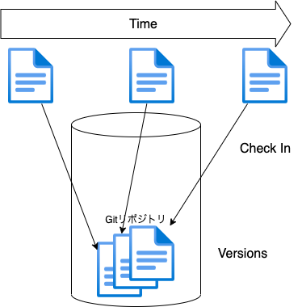
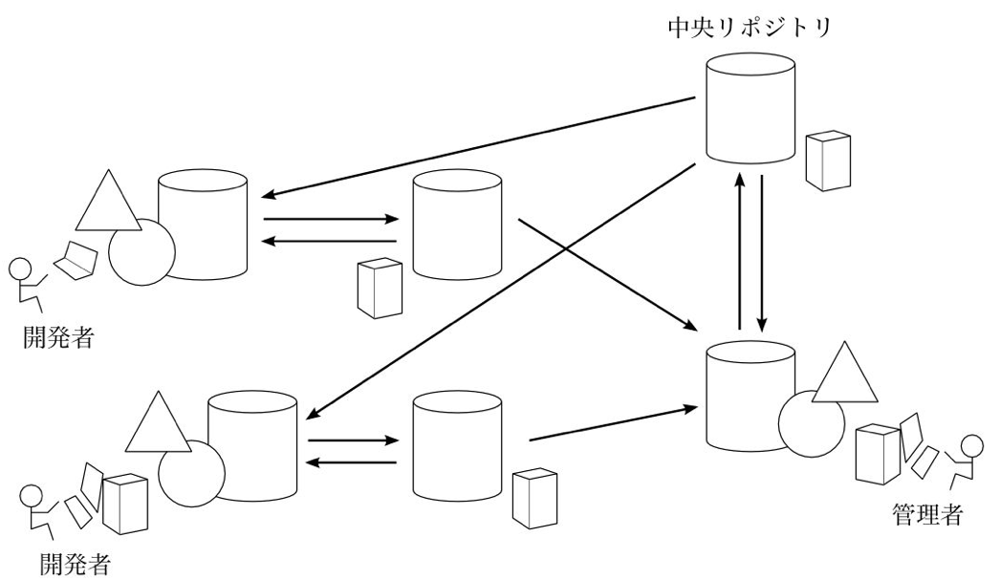

# Git とは

---

# Git とは

- 分散型バージョン管理システム DVCS (Distributed Version Control System)の一つ

---

# バージョン管理システムとは

- バージョン管理システムとはファイルの履歴を管理するシステム
- ファイルの状態を取っておきたいと思ったときにそのファイルの内容をバージョン管理システムにチェックインする
  - Git ではチェックインをコミットと呼ぶ
- チェックインされた状態が一つのバージョンになる
- バージョンを入れる場所をリポジトリと呼ぶ
- ファイルは任意のバージョンにいつでも戻ることができる
  - これをチェックアウトという

---

---

# 分散型バージョン管理システムとは？

- 同じプロジェクトのリポジトリをネットワーク上に複数置いて管理できるバージョン管理システム
- 複数人が同じプロジェクトで開発する際に便利
- Git は分散型バージョン管理システムの中でも最も有名
- 中央にプログラムを統合するためのリポジトリを置き，個人ごとに存在するリポジトリと同期することで開発を進める

---

---

# Git はなぜ必要なのか?

- プログラムは脆く壊れやすいため，いつでも望ましいバージョンに戻れることが大事で，それを実現するためのツールだから

  - ゲームで例えるならセーブ．めっちゃむずいゲームでセーブがないとかやってられない

- プログラムは複数人で開発することが多く，その際に課題となることを解決してれくるソリューションだから
  - どうやってプログラム同士を結合するのか？Git であれば安全にプログラム統合できる
  - どうやってプログラムの変更を共有するのか？中央リポジトリを使えば変更を共有できる
  - どうやってプログラムの変更を管理するのか？Git であれば変更を管理できる
  - 誰がどのような変更をしたのか管理する必要がある. Git であれば誰がどのような変更をしたのか管理できる

---

# Git はどのような時に使われているのか？

- ソフトウェアを作成するときに必須と言っても良いほど
  - これを導入していない開発は相当萎える...
  - 複数人で開発するときに効果があると述べたが，一人で開発しているときでも効果があり，利用は必須
- ソフトウェア以外にも様々な用途で利用されている
  - ドキュメントを書く際にも利用されている

---
