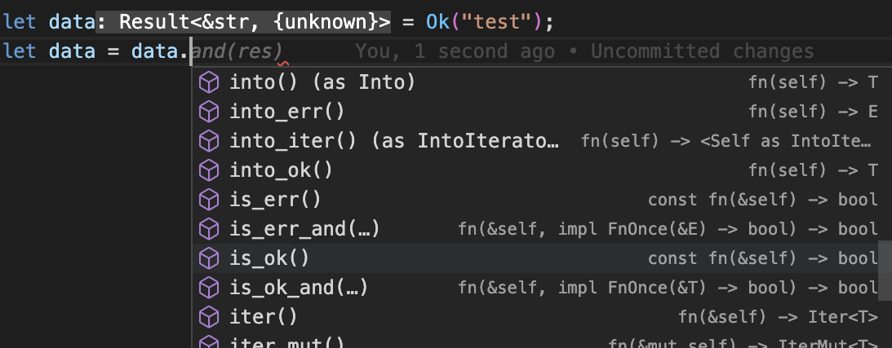
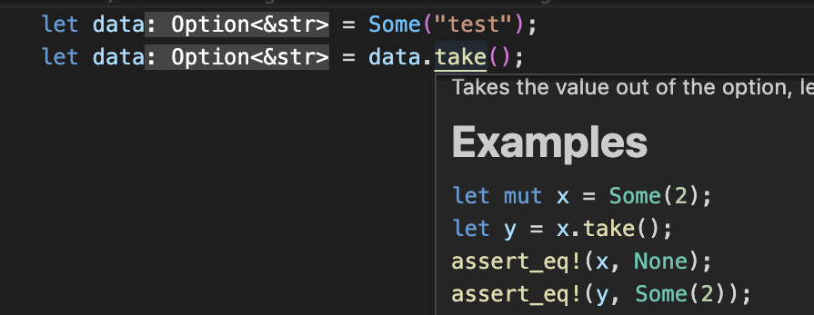

# 最先端？言語 Rust の紹介

---

# はじめに

- 本発表は自組織とは関係がなく，個人の意見です.
- Rust にバイアスがかかった発表内容かもしれません.ご了承ください.

---

# 本日の狙い

- 一人でも多くの方に Rust に興味持ってもらう!
  - よくわからんけど，なんかすごそう！試してみよう！と思ってもらえるように資料を作成しました！
- あわよくば弊社 Rust の輪を広げる!

---

# Rust とは?

---

# よく言われていることは．．．

- 2015 年に ver1.0 がリリースされた比較的若い言語
- stack overflow の愛されている言語ランキング 7 年連続 1 位！
- 実行スピードは C,C++ 言語並みにも関わらずメモリ安全！
- 安全性と実行スピードから, 他言語からの置き換えとして名だたる企業が注目！
  - Amazon
  - Google
  - Microsoft ...
- 学習コストが高い...

---

- ## C 言語並みのスピードなんてほとんど不要では？🤔

- ## なんだか難しそう．．．😵‍💫

---

- # スピードだけじゃないんです!!👍
  - ## 仕様や標準パッケージなどが最高!!😍
- # 仕様に慣れれば一気に好きな言語に(なるはず)

---

# 好きな仕様や機能一覧

- if 式
- if let ,let else
- trait
- 型システム
- test
- イテレーター
- パターンマッチ
- 宣言マクロ
- 手続きマクロ
- 所有権
- ライフタイム
- コンパイラー(めっちゃ優しい)

---

# 堅牢でスマートな型システム

- Rust は静的型付け言語の中でも強い型整合
  - 型の整合さえクリアすればコードが動くと自信を持てる！💪
  - 型が多くを語ってくれるため，可読性が高いコードができる!👍

```rust
fn bin_to_hex(bin:&str)->Result<String,Error> {...}
```

- 型推論が賢いから，定義以外で型を書くことはほとんどない！🥰

```rust
// 関数定義
fn make_rand(seed:usize) -> usize {...}
// わざわざ型を書かなくてもOK
let rand_data = make_rand(0);
```

---

# 便利な型とよくデザインされているメソッド群

- 失敗を表せる Result や 存在しない可能性を表せる Option など便利な型が多い
- そしてそれらの型にはよくデザインされたメソッドがたくさん備えられている
  
- 標準機能の多くは doctest によって使い方が示されている
  

---

# でも型の整合性が強いと柔軟性がなくならない？？🤔

```rust
fn my_print(data:&str){
  println!("{}",data);
}
// OK
my_print("Hello world!");

// NG
my_print(100);

// NG
// Rustにはたくさんの文字列を表現する型があります．．．
my_print(String::from("Hello world!"));
```

---

# trait や Generic による柔軟性

```rust
// traitを定義
trait Printable:Debug {}
// Genericを使って関数の引数を定義
// このPはPrintableを実装していれば何でもOK!
fn my_print_use_generic<P:Printable>(data:P){
  println!("{:#?}",data);
}
// traitのすごいところは型の定義よりも後に実装を行うこと!
impl Printable for usize {}
impl Printable for str{}
impl Printable for String{}
impl Printable for MyStruct{}
// Third partyが定義した型にも独自の振る舞いを追加できる(逆もまた然り)
impl Printable for LibraryStruct{}
// All OK
my_print_use_generic("Hello world!");
my_print_use_generic(String::from("Hello world!"));
my_print_use_generic(100 as usize);
my_print_use_generic(MyStruct::new());
my_print_use_generic(LibraryStruct::new());
// NG -100(i32型)にPrintableは実装されていないのでNG
my_print_use_generic(-100)
```

---

# test が言語仕様に組み込まれている

- 多くの言語はテストライブラリのインストールが必要
- Rust だと下のようにコードを書いて cargo test で OK

```rust

fn add(left:i32,right:i32) -> i32 {
    left + right
}

#[cfg(test)]
#[test]
fn test_add() {
    assert_eq!(add(3,4),7);
}
```

- しかもテストを実装コードと同じファイルに書ける!
  -> 書きやすい＆コードの挙動をすぐに確認できる&TDD も捗る！

---

# 有働的本番プロジェクトで Rust を採用する旨み

- 型システムによって高速なフィードバックが得られる&型安全で品質の高いシステムが作りやすい
- テストが実装の近くに書けることや高度な型システムなどのおかげで，可読性や保守性が高いコードになりやすい
- 宣言的に書きやすく，うまくかければ可読性の高いものにできる
- 実行時間が早いことや，メモリ消費量を抑えられることから計算リソースの節約が可能
- 実行速度がネックになりにくい

---

# 他にもたくさん魅力がありますが今日はここまで！

---

# おすすめの Rust コンテンツ

- rust the book
  - 無料の Web コンテンツ
  - 基本的なことが丁寧に解説されている
  - https://doc.rust-jp.rs/book-ja/
- rust playground
  - Rust の web 実行環境
  - 公開されているライブラリも使うことができる!
  - https://play.rust-lang.org/?version=stable&mode=debug&edition=2021
- プログラミング Rust 第 2 版
  - 詳しくわかりやすく説明されている

---

# 終わりに

- 本日はありがとうございました！
  - 所有権について話したかったですが,説明できる自信がなかったです...
- もしご興味あれば,可能な範囲でご相談に乗らせていただきます!

  - ただ，私もそこまで詳しいわけではないので一緒に勉強できたら嬉しいです!

- みなさまが Rust に興味を持っていただけ，挑戦していただけましたら幸いです!

---

# ありがとうございました！

---

---

# おまけ：紹介しようとして時間がなかった macro

- 名前の後ろに!がついているもの
- 標準で用意されているものも多いが，自分で作成することも可能

```rust
println!("{}",data);
assert_eq!(1,1);

// Rustは型に厳しいので関数で可変長引数は受け取れない．
// マクロでは可変長引数を受け取れるように設計可能
let concat:String = format!("{}/{}"month,day);
let groups:Vec<&str> = vec!["tic","it","dict"];
```

- 関数と似ているけど違うもの
  - 関数 -> 実行時にコードが実行
  - macro -> コンパイル時にコードとして展開される
- コンパイル前にコードが生成されるイメージ!

---

# 自作 macro の例

```rust
// マクロの定義
macro_rules! fn_time {
    ($fn:ident,$($args:ident),*) => {
        // timerを起動
        let timer = std::time::Instant::now();
        // ???
        $fn($($args),*);
        // このコードに到達するまでにかかった時間を出力
        println!("time = {:?}", timer.elapsed());
    };
}

// 引数の秒数だけ処理をsleepさせる模擬コード
fn heavy_calc(sec:usize) {
    sleep(Duration::from_secs(sec));
}
// マクロの実行
fn_time!(heavy_calc,1);
// time = 1.00002s
```

---

# macro が展開された時のイメージ

```rust
// 実際のコード
fn_time!(heavy_calc,1);

// 説明用に定義を再掲
// macro_rules! fn_time {
//     ($fn:ident,$($args:ident),*) => {
//         let timer = std::time::Instant::now();
//         $fn($($args),*);
//         println!("time = {:?}", timer.elapsed());
//     };
// }

// コンパイル前のコード展開イメージ
let timer = std::time::Instant::now();
heavy_calc(1);
println!("time = {:?}", timer.elapsed());
```

- 関数では到達困難な表現力！
  - コードの間に任意のコードを差し込むことは関数では難しいはず

---

# 補足：本番プロジェクトで採用する辛み(予想)

- 学習コストが高い
- クレート(ライブラリ)の充実度が発展途上
  - AWS SDK はまだ Developer Preview
  - 他 サービスの SDK についても基本 Rust 製のものは少ない
- 多機能ゆえにコードの統制が難しいかも
  - for 文を使うのかイテレーターのメソッドを積極的に使うのか？
  - macro を使ってコード量を減らすのか愚直に書いて可読性を上げるのか

---

# Rust を学んでよかったこと

- メモリの割り当てやポインタなど深い知識を身につけることができた
- 設計力が上がった気がする
  - 強力な型システム
  - trait 境界
  - 所有権
- test を書きたい欲が強くなった & test の大切さを再認識できた

---

# Rust を学んでよくなかったこと

- Rust しか書きたく無くなった 😢

---

# 補足：今後やりたいこと

- Rust で大規模開発
- wasm

---

---

# 型があることの恩恵

```python
def add(i,j):
    return i + j
```

```rust
fn add(i:i32,j:i32) -> i32 {
    i + j
}
```

---

# 堅牢な型システム Option 型

```rust
let data = [1,2,3];
println!("{}",data[3]);
// error: this operation will panic at runtime
// index out of bounds: the length is 3 but the index is 3
```

```rust
let data = [1,2,3];
let maybe_d3:Option<&usize> = data.get(3);
match maybe_d3 {
    Some(d) => println!("{}",d),
    None    => println!("data len is {}",data.len()),
}
// data len is 3
sum = maybe_d + 3;
//error[E0369]: cannot add `{integer}` to `Option<&{integer}>`
```

- 型レベルで存在しない可能性がわかる
- Option 型にはたくさんの便利メソッドがある
- 型によって守られているので，コンパイラに任せてストレス無く開発できる

---

# 堅牢な型システム Result

```python
with open("test.txt","r") as f:
    data = f.read()
# FileNotFoundError: [Errno 2] No such file or directory: 'test.txt'
```

```rust
let data = read_to_string("test.txt");
match &data {
    Ok(d)     => println!("{:#?}",d.split("\n").next()),
    Err(e)    => //something error case
}
lines = data.split("\n");
//error[E0599]: no method named `split` found for enum `Result` in the current scope
```

- 型レベルで失敗する可能性があるのかがわかる!
- Result 型にはたくさんの便利メソッドがある

---

```rust
// Resultは成功しているかどうかの確認を強いる->エラーチェックを忘れない
fn read_to_string(file:String)->Result<String,Error>;
let data = read_to_string("test.txt");

let lines = data.split("\n");
//error[E0599]: no method named `split` found for enum `Result` in the current scope

let lines = match &data {
    Ok(d)     => d.split("\n").next().unwrap(),
    Err(e)    => ""
}
//ok!
```

---

# 型がないと前提知識が必要なことがある

```python
# 誰かが書いたコード(または半年前の自分が書いたコード)
def get_child_from_class(class_,name):
    return class_.get(name)
```

- 関数名から察するに child を返すみたいだけど，child ってどんな値？
- name は str でいいのかな？class\_に name の child がいなかったらどうなるんや？
- そもそも class\_ってどんな型?

---

# 型は多くを語ってくれる

```rust
// 誰かが書いたコード(または半年前の自分が書いたコード)
fn get_child_from_class(class:Class,name:String)->Option<Child>{
    class.get(name)
}
```

- Class 型から文字列を入れると Child 型が帰ってくるんだな
- しかもその Child は存在しない場合があるから，その際のことも考えよう！

---

# 便利な機能

- if let/let else

```rust
if let Some(name) = group.get("kai") {
  // process use name
}
let Some(name) = group.get("kai") else {
  return
}
// process use name
```

---

# 型の紹介: mut 型

- 値が変更するか否かに対しても型がつけられています!

```rust
fn add_str(data:&mut String,added:&str){
  data.push_str(&added);
}

let mut h = String::from("Hello")

// hが書き変わっていることが明白
add_str(&mut h,"world")

println!("{} ",h);
// Hello world
```

- データが知らないうちに変更されている...っていうのが型レベルで明確になる!

---

# 型の紹介: Result,Option 型

- 失敗しうるものや，存在しない可能性があるものに対する型があります
- チェックをコンパイラが強制してくれるので，安全なコードが書ける!

```rust
let data = [1,2,3];
println!("{}",data[3]);
// error: ...
// index out of bounds: the length is 3 but the index is 3

let maybe_d3:Option<&usize> = data.get(3);

//error[E0369]: cannot add `{integer}` to `Option<&{integer}>`
let sum = maybe_d + 3;

// Option型やResult型などの展開を援助してくれるmatch(本当はもっとすごいです！)
let sum = match maybe_d3 {
    Some(d) => d + 3,
    None    => 0
}
```

---

# 3. コンパイラや標準機能が優しい

- 標準機能のほとんどに doctest が記入されているので迷うことがない!
  
- コンパイラが丁寧に教えてくれる！

  - コンパイラの指示に従っていればあらかた上手くいく！
  - ペアプロしているみたい

---

# 目次

- 本日の狙い
- Rust とは？
- 推しポイント
- おすすめの Rust コンテンツについて
