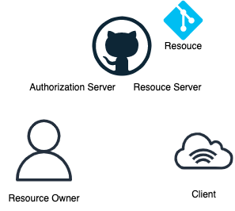
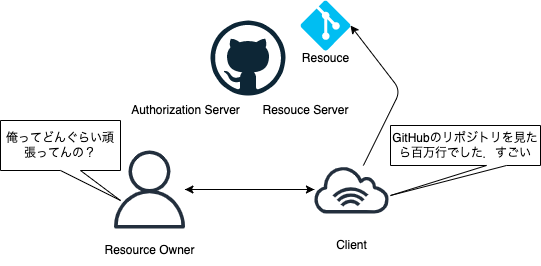
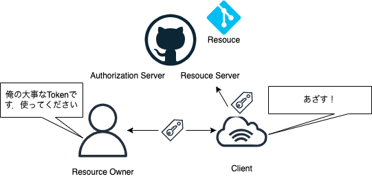

# OIDC&OAuth2.0 の説明

---

# OIDC とは?

- OpenId Connect のこと
- OAuth2.0 をユーザ認証として活用するために拡張したもの

---

# OAuth2.0 とは?

- 認可フレームワークのこと

---

# 認証と認可

## 認証(Authentication)

- 何であるかを確認すること

## 認可(Authorization)

- 権限を与えること

参考 :https://dev.classmethod.jp/articles/authentication-and-authorization/

---

# 認証と認可の違いがわかったところで OAuth

## ざっと説明

- ユーザーがパスワードなどをサービスに提供することなく，ユーザーのリソースにおける権限をサービスに与える(認可する)ことができる仕組み

---

---

# 登場人物の整理(言葉)

- Resource Owner
  - さっきの文脈だとユーザー
- Authorization Server(認可サーバ)
  - アクセストークンを発行するサーバ
- Client

  - さっきの文脈だとサービス
    - 僕的に Client だとユーザーっぽく感じてややこしい...

- Resource Server
  - アクセストークンを発行するサーバ

---

# 登場人物の整理(図)

注)Authorization Server と Resource Server のエンドポイントは異なる

---

# 登場人物がわかったところで，使った架空のアプリケーションで OAuth を説明します

---

# 架空アプリケーションの要件

- ユーザー(Resource Owner)の全 GitHub リポジトリのコード数を計測する
- プライベートリポジトリも含む

---

# プライベートリポジトリの計測について

- Client はプライベートリポジトリを見る権限がないので計測することができない
- 方法はいくつかある
- 例えば pat(Personal Access Token)や SSH Key を Resource Owner に入力してもらってそれを利用する

---

# 本当にそれで OK?

- もし Client が脆弱なサービスだったら？
  - 渡したトークンが Client 経由で漏洩してしまう
- もし Client が悪意のあるサービスでかつ渡した pat に強力な権限がついてたら？

  - いろんな悪用がされてしまう

# 機密情報を他サービスに渡すことは重大リスク！

---

# じゃあ今回のプライベートリポジトリのコード数計測は諦めるしかないのか．．．

---

# そこで使えるのが OAuth！！

---

# 最初のおさらい

- ユーザー(Resource Owner)がパスワードなどをサービス(Client)に提供することなく，ユーザーのリソースにおける権限をサービスに与える(認可する)ことができる仕組み

- つまり今回だと，pat を渡さずとも，Client にプライベートリポジトリを見ることができる権限を与えることができる

---

# 実際のフロー

- 今回は一番利用されるケースが多い方式である認可コードグラントについて説明します

---

参考: https://qiita.com/TakahikoKawasaki/items/f2a0d25a4f05790b3baa

---

- OAuth2.0 は認証の日時や手段などやユーザー情報を取得するための仕様が定められてない
- これだと，アプリは誰がいつどのように認証したのかがわからない
- これらの情報を取得するための独自 API を Provider 側が提供するなどしてこの問題に対応する必要があった

# OIDC とは

- OAuth2.0 をユーザ認証として活用するために拡張したもの
- 主な拡張としては認証時に情報を記載した ID トークンという概念とユーザの情報を取得するためのエンドポイントを定めた点
- アクセストークンの発行と合わせて ID トークンを発行してもらう
- これにより，ユーザを特定する ID や認証した日時などを知ることができる
- またユーザーのメールアドレスやプロフィール画像などをユーザ情報のエンドポイントから取得することができる
- 実際には ID トークンの中にユーザ情報も含まれるため，ユーザー情報のエンドポイントは不要なケースもある
