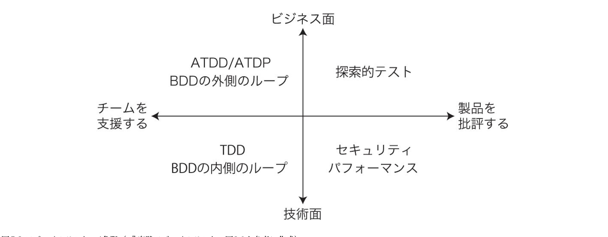

# TDD とは ?

---

# 目的

- TDD は何なのかがわかるようになる

  - 何を目的としているものなのか？
  - どのような手法なのか？
  - 何が嬉しいのか？

- TDD が必要な理由/背景がわかる

---

# TDD とは

- Test Driven Development の略
- 日本語でテスト駆動開発
- つまり，テストによって開発を進めていく(駆動する)開発手法
- 開発手法というよりも **設計手法**という考えもある

---

# そもそもテストとは？

- このページで述べるテストとは開発したシステムやその構成要素が**想定通りに挙動するか**を確かめるもの

- 例えば
  - 画面のボタンを押下したら正常なリクエストが処理されるかどうか
  - 内部の集計を行う関数の結果が正常かどうか
  - 不正な値を入れたらエラーを吐くかどうか
  - システムの変更によって，デグレが起きてないか
  - など...

---

# テストは何ではないか？

- バグを 0 にするものではない

  - 未知の未知を 100％テストで抑えることは比較的難しい
    - ただし，それを探求して見つけることがテストの一つの目的ではある

- システムのエンドユーザーまたは開発依頼元への直接的な価値にはならない

  - システムの価値はそのシステムの振る舞いによって提供される
    - システムの振る舞いを決めるのはテストではく，プロダクトコード
  - テストはシステムの品質向上に寄与するが，その手段でしかない
    - ユーザーにとってはテストがあるかどうかはどうでもよい

---

# テストの種類

- テスト実行方法とテスト実行範囲それぞれに対して以下のような種類がある
  - 粒度や呼び方に関しては別のものもある

### テスト実行方法

- 手動テスト
- 自動テスト

### テスト実行範囲

- E2E(UI からバックエンドまで)
- 統合テスト(各構成要素同士を組み合わせたテスト)
- 単体テスト(各構成要素単体のテスト)

---

# 一昔前からあるテストの考え方

- デプロイしようとしているテストが要件通りに動くかどうかを確かめて，品質を保証するために必要
- システムの実装を終えてからデプロイする前に一度手動テストを実行
- 全てのテストに成功したらデプロイ可能,失敗したらテストを成功させるようにコードを修正

---

# 前ページのテスに関する問題点

- 手動なので時間がかかる

  - システムが成長するほど時間がかかるようになる

- デプロイする前にしかテストを実行しないので,テストからは高頻度なフィードバックを得ることができない
  - というか得ようとしていない

---

# 良いテストの考え方

一般的に良いテストとは次のような考え方

### テスト実行方法

- 自動テスト

### テスト実行範囲

- E2E は数個
- 統合テストは 全体の 2 割ほどに抑える
- 単体テストは 全体の 8 割を目指す

### テストのカバレッジ(テストで実行されているコードパスの割合)

- 8 割あたりを目指す

---

# なぜ？

- 高速かつ頻繁にテストからフィードバックを得るため

---

# テストから得られるフィードバックとは？

- テストがよく整備されていればシステムが想定通りに動くかどうかがわかる

  - システムが想定通りに動いているのか？
  - 新しいコードは想定通りに動くのか？
  - 変更によってシステムが壊れていないか？

- これによって，自信を持ってコードを変更できる!
- テストに合格すれば自信を持って本番環境にデプロイできる!

---

# テストがあるとどうなる?

- テストを行うことで正常に動作する!!と，自信を持つことができる
  - 自信をもって本番環境へデプロイできる

---

# TDD 本

---

# 前書き

- 動作する綺麗なコード，これが TDD のゴール
- 動作する綺麗なコードはあらゆる意味で価値がある
  - 開発が予測可能になる
    - 完成したかどうかがわかり，バグが残っているかを心配する必要がない
  - コードが伝えようとしていることを余す所なく受け取れる
  - 最初に思いついたコードを書き殴っただけで終わりなら，再考してより良いコードを書くチャンスは永遠にこない
  - あなたが作るソフトウェアのユーザを快適にする
  - チームメイトはあなたを信頼し，あなたもまたチームメイトを信頼する
  - 書いていて気持ちいい

---

# TDD のスタイル

- 自動化されたテストが失敗した時のみ，新しいコードを書く
- 重複を除去する

---

# 個人とグループの振る舞いに与える影響

- 有機的に設計を進められるようになる
  - 動作するコードが設計判断にフィードバックをもたらすから
- 自分たちでテストを書くようになる
- 小さな変更に迅速に応答する開発環境を備えなくてはならなくなる
- 凝集度が高く，結合度が低いたくさんの部品で構成された設計を行うようになる．
  - その方がテストが書きやすいから

---

# 作業手順

1. レッド
   - まずはあるべき姿(実装がないので失敗する)をテストとして書いてそのテストを失敗させる
1. グリーン
   - そのテストを迅速に動作させる
1. リファクタリング
   - テストを通すために発生した重複を全て除去する

---

# テスト品質

- TDD のテストは以下のテストの代替になることは考えない方が良い

- パフォーマンステスト
- 負荷テスト
- ユーザビリティテスト

---

# 因果ループ図

- ノードからノードへと伸びる矢印は視点ノードにおける増加が終点ノードにおける増加，始点ノードにおける現象が終点ノードにおける減少を導くという意味
- マルのついた矢印は始点ノードにおける増加が終点ノードにおける減少，始点ノードにおける現象が終点ノードにおける増加を導くという意味

---

- ストレスレベルが増加すると，悪循環が発生する
- ストレスがかかるほど，テストを行う頻度が減る
- テストが減ればエラーが増える，エラーが増えればストレスも増える

---

- 上記のループから脱出するには新しいノードを追加するか，既存ノードを置き換えるか矢印を変更するか
- テストを自動テストに入れ替える
- 自動テストがある時はストレスを感じたらテストを走らせる
  - テストを走らせることで何も壊れていないことを確認できる

---

# TODO リスト

やるべきことを漏らさず記録する方法として「すべて頭に入れておく」というやり方がある。私はこのやり方に何年も挑戦してきたが、それでは悪循環に陥ってしまうことに気づいた。経験を積めば積むほど、やるべきかもしれないことに数多く気がつくようになる。やるべきかもしれないことが増えると、いま何をやっているのか見失いやすくなる。いまやっていることを見失うと、やるべきことをあまり達成できない。やるべきことが達成できなければ、これからやるべきことは増えてしまう。頭の中のやることリストの中からランダムに選び、気まぐれにコードを書くやり方も試してみたが、憂鬱な無限ループを脱出することはできなかった。最後に、これから数時間で行いたいと思うことすべてを紙に書き出す、という手法を試してみた。それまでも紙に書いてはいたが、今週や今月行うことを書いて壁に貼っておくような、粗い粒度のものだった。そして頭の中をすべて紙に書き出したとき、何も忘れずに済む方法をようやく見つけたことに気がついた。新しく何かを考えついたときには「すぐやる」「あとで」のリストに加えるか、全くやる必要無しであるかを素早く意識的に判断すればよくなったのだ。テスト駆動開発の言葉に翻訳するならば、リストに加えるのは実装したいものに対するテスト、ということになる。まず、実装しなければならない振る舞いを考えられるだけ書き出してみる。次に、まだ実装がない操作に関して、空実装をリストに加える。最後に、いま書いたばかりのコードをきれいにするためのリファクタリングをすべて書き出しておく。テストの概要ではなく、テストコードを一気に全部書いてしまえばいいじゃないかと思われるだろう。だが私の場合は、テストを一気に書き上げる方法が 2 つの意味でうまくいかなかった。まず、既に書かれているテストというものはすべて、リファクタリングの際にはある種の慣性を伴う。自動リファクタリングツールがあればそこまで問題にはならないが（メニューから変数の改名を選んだら、宣言部だけでなく、その変数が利用されているところもすべて変えてくれるようなやつだ）、例えば 10 個のテストを書いた後で、あるべき引数の順番が逆なことに気づいたとしたら、ちょっと面倒だなと感じるのではないだろうか。次に、もし 10 個のテストが失敗しているなら、グリーンバーからかなり離れてしまっている。短い時間でグリーンバーに戻りたいなら、その 10 個のテストを捨てなければならない。そうではなく、失敗しているテストを動く状態まで戻したい
なら、今度は長い間レッドバーを見続けることになる。バーが赤いとトイレにも行けないほどのグリーンバー中毒なら、この時間は永遠にも感じられるだろう。慎重な登山者の間では、両手両足の合わせて 4 本のうち 3 本は陸地に接していなければならないというルールがあるそうだ。大胆にも 2 つ同時に動かすと、危険が大幅に増すというわけだ。グリーンバーから行える変更は 1 つだけというテスト駆動開発の基本形は、この登山者のルールに似ていると言えるかもしれない。テストを書いて走らせると、新しいテストを思いつくことが多い。新しいテストはまずリストに書こう。もちろんリファクタリングもだ。「なあ、このコードどんどんひどくなってきてないか？」「（ため息）リストに加えておいて、チェックイ
ン前には修正しよう」作業時間が終わってもリストに残っている項目には少し注意しなければならない。まだ機能が半分も完成していないならば、同じリストを次の作業時間にも使い続けよう。目前のスコープには収まらない大きなリファクタリングの必要性を発見したなら、「あとでやる」リストに加える。ただ、私はテストケースを「あとでやる」リストに移動したことはない。動作しないであろうテストを考えついたのなら、それを動作させるほうがコードのリリースよりも大事だからだ。

---

システム構築はどこから始めるべきだろうか。システム構築が終わったらこうなる、というストーリーを語るところからだ。機能はどこから書き始めるべきだろうか。コードが書き終わったらこのように動く、というテストを書くところからだ。ではテストはどこから書き始めるべきだろうか。それはテストの終わりにパスすべきアサーションを書くところからだ。

---

# 最初にテストを書く項目

- TODO リストの中で最初にテストを書く項目は，わかりきってはいないが，書けば動かせそうな気がするテスト

- トップダウンかボトムアップかよりも既知から未知への方が有用

---

疲労と判断もフィードバックループがある

---

# テストしなくても良いものはあるのか？

- 不安が退屈になるまでテストを書く
- 以下はテストすべき対象
  - 条件分岐
  - ループ
  - 操作
  - ポリモーフィズム

---

# 良いテストを見分けることができるか

- テストは設計から立ち上がる悪臭を敏感に察知して教えてくれる
- 設計に問題を抱えている場合，テストには以下のような兆候が現れる

  - 前準備に要するコードが長い

    - アサーションを行うテスト対象オブジェクトの準備に 100 行のコードが必要なのであれば，何かがおかしい
    - そのオブジェクトは大きすぎるので分割した方が良い

  - 前準備コードの重複

    - 共通の前準備コードを配置する場所がすぐ見つからないのは，互いに蜜に関連し合うオブジェクトが多すぎることを示唆している

  - テスト実行時間が長い
  - 脆いテスト
    - 思わぬタイミングで失敗するテストはアプリケーションのどこかが意外な形で他の部分に影響している可能性を示唆している
    - 2 つの部分の関係性を断つか，または統合するなどして，離れた箇所から影響を排除するように設計し直さなければいけない

---

# TDD はどのようにフレームワークを導くか

---

# どのくらいのフィードバックが必要か

- TDD においてテストは目的を達成するための手段であり，その目的とは大いなる自信を伴うコード
- 品質が満たされているか検証するテストとは目的が異なる

---

# TDD の T はテストの一部にすぎない

- テストとはエラーを見つけるつもりでプログラムを実行する過程
  - 認知の外を探究する
- TDD の テスト は Checking ににている
- 実際にテストを行っているのではなく，自分が考えた通りに動くかどうかを確かめている，つまり高速でチェックしているものという考え
- これは一定の納得感を与えるが，テストが最初に作成される TDD では，チェックする対象の実装がまだ存在しないこと，および Checking が開発者を駆動するとまでは考えにくいことから Checking Driven Development という言葉が生まれることはなかった
- 継続的デプロイ本でも TDD は誤解させるいい名前ではないが，TDD としか命名しずらいということが書いてあった

- https://www.satisfice.com/blog/archives/856

---

- TDD を行っているからバグはないや，TDD を行っているからテストエンジニアは不要，といった発言が誤っているのは TDD には第三者テストのような批評の視点が欠けているから

---

GOOS のテスト駆動開発は外側から攻める
つまり使い方から入って使ってから作るということ
TDD も作ってから作るという思想ではあるが，あくまで自分一人でできる技術にスコープを当てている

GOOS に記されている Mockist TDD はそれを要件定義やアーキテクチャ選定，チーム開発のレベルまで拡大していく試みと捉えてもよい
GOOS には外から内へという向きが存在する
またそれは，未知から既知でもある

失敗する受け入れテストを書く->失敗するユニットテストを書く->テストを通するようにする->リファクタリングする->回す->

---

TDD の本質は精神状態のコントロール、不安と自信の制御にあるからです。結果（書かれたコードとテストコード）ではなく、過程（思考プロセスとリファクタリング）に本質があります。

---

# 継続的デプロイ本

---

- コードの 1 番の目的は動くことではなく，人に理解してもらうこと
  - 挙動だけであればバイナリでいいはず

---
